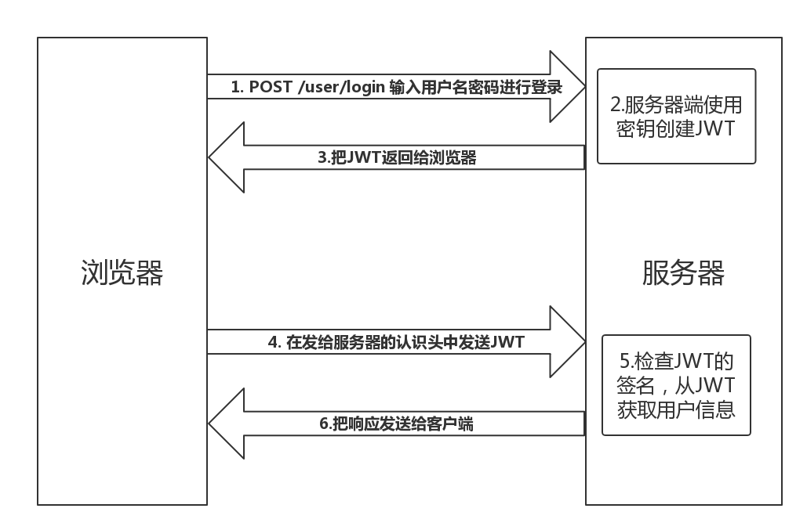

# JSON Web Token(JWT)

## 概述
  
  jwt是一种权限认证方法。

  jwt常常在web开发当中被直接叫做token，它被用来当作网站登陆者的一种认证凭据，根据这个凭据可以向web服务器获取相关需要用户认证后才能获取的资源。

## 结构

jwt的表现形式是eyJ0eXAiOiJKV1QiLCJhbGciOiJIUzI1NiJ9.ImpheWxlbiI.SGsImtVlSPamvOLP1aD543Jhr3dQfE5cHdM3C2KC47c

总共由三个部分组成，每个部分之间用`.`分隔开。

该结构包含如下：

- eyJ0eXAiOiJKV1QiLCJhbGciOiJIUzI1NiJ9：token的类型和对接下来第二部分加密采用的算法：`{ "alg": "HS256", "typ": "JWT"}`

- ImpheWxlbiI: 传输的内容：`jaylen`

- SGsImtVlSPamvOLP1aD543Jhr3dQfE5cHdM3C2KC47c：由第一部分和第二部分生成的签名

## 应用场景

- 前端向服务器发送用户登陆的账号密码，服务器通过后返回jwt给前端，表示用户认证成功
- 前端将这个jwt保存在浏览器本地(cookie或者localstorage)
- 前端发送请求给服务器索取相关需要认证的资源时，从本地取出jwt在请求头上携带上jwt（一般在axios请求拦截器做）:`Authorization: Bearer <token>`-注意`Bearer`+空格+`token`
